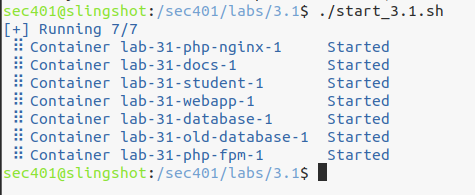
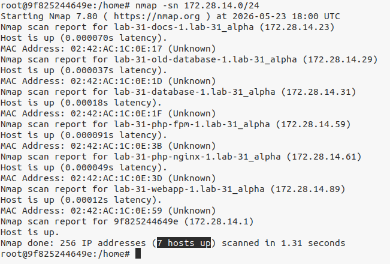
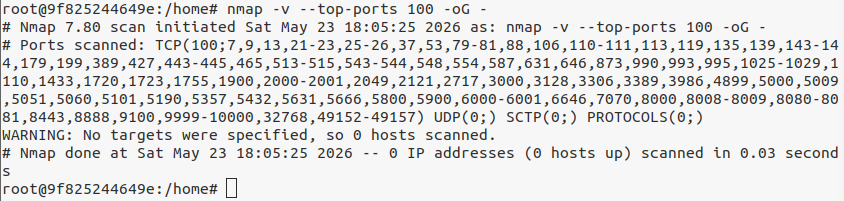
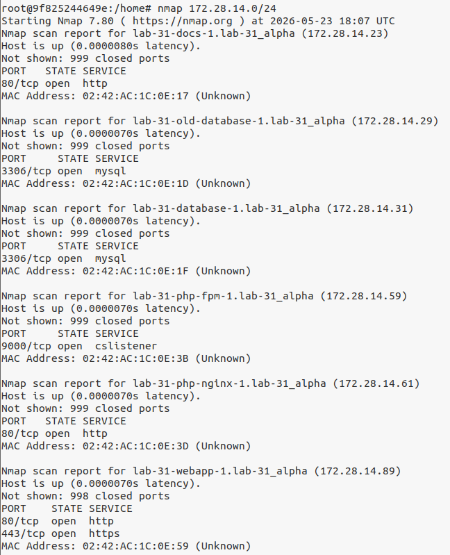
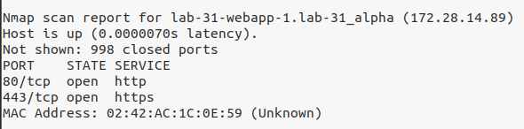
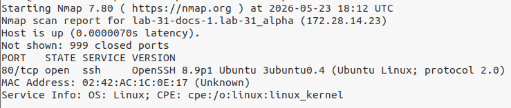
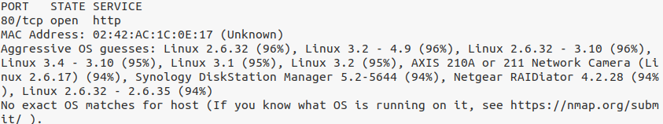

# Lab 35 - Network Discovery with Nmap

## Lab Objective

The purpose of this lab was to use Nmap to discover hosts, identify open ports, detect services, and attempt operating system detection on a simulated target network.

This lab focused on network discovery and enumeration. It also showed why assumptions based only on port numbers can create visibility gaps. A port may be open, but the service running on that port may not match the expected default service.

## Professional Relevance

### GRC Relevance

From a GRC perspective, network discovery supports asset visibility, risk assessment, vulnerability management, and control validation.

This lab connects to GRC because:

- Organizations need accurate asset visibility before they can assess or manage risk.
- Open ports should be reviewed against business need.
- Services running on non-standard ports can indicate misconfiguration or unauthorized activity.
- Security controls should be validated against what is actually running, not just what documentation says should be running.
- Network scanning should be authorized, scoped, and documented to avoid operational or legal risk.

This lab also reinforces the difference between control design and control validation. A system may be expected to expose only approved services, but discovery and service scanning help confirm whether that is true in practice.

### IT Support / SOC Analyst Relevance

From an IT support or SOC analyst perspective, this lab supports troubleshooting, investigation, and alert validation.

This lab connects to IT and SOC work because:

- Host discovery helps confirm which systems are online.
- Port scans help identify exposed services during troubleshooting or incident response.
- Service detection helps identify what is actually running on a system.
- Non-standard service placement, such as SSH running on port 80, may indicate misconfiguration or suspicious activity.
- OS detection can provide useful context during triage, although results may be unreliable in containerized or simulated environments.

For IT support, these techniques can help troubleshoot connectivity and service availability.

For SOC analysts, these techniques can help validate suspicious activity, investigate exposed services, and compare expected system behavior against actual network behavior.

## Lab Environment

This lab used the Slingshot VM and a simulated target network running in Docker containers.

### Lab Walkthrough

Target network: 
```bash
172.28.14.0/24
```

The lab containers were started with:
```bash
./start_3.1.sh
```

After running the command, I confirmed that 7 containers were running.


For the rest of the lab, commands were run from inside the student container:
```bash
./connect.sh
```

### Host Discovery Scan

The first task was to scan the lab network to discover live hosts without performing a port scan.

Command used:
```bash
nmap -sn 172.28.14.0/24
```
The -sn option performs host discovery only. It identifies which hosts are up without scanning their ports.

Result:

Nmap identified 7 hosts up on the target network.


#### Analysis

This step is useful because it establishes basic asset visibility. Before reviewing ports or services, I first needed to know which hosts were active on the network.

From a GRC perspective, this supports asset inventory and control validation.

From an IT support or SOC perspective, this helps confirm whether systems are reachable before deeper troubleshooting or investigation begins.

### Listing Nmap's Top TCP Ports

Nmap scans the 1,000 most common TCP ports by default. To view the top 100 TCP ports as defined by Nmap, I used:
```bash
nmap -v --top-ports 100 -oG -
```

Command breakdown:
1. ```-v``` enables verbose output
2. ```--top-ports 100``` lists the top 100 most common TCP ports
3. ```-oG -``` outputs in grepable format to standard output
4. ```-``` indicates there is no target system being scanned

Result:

Nmap displayed the top 100 TCP ports it commonly scans.


#### Analysis

This step helped explain what Nmap checks during a default scan. Since Nmap scans common TCP ports by default, the results are useful, but they are not a complete guarantee that every possible service has been checked.

From a GRC perspective, this matters because scan scope affects the reliability of control validation.

From an IT support or SOC perspective, this matters because a default scan may miss services running on less common ports.

### Port Scan of the Target Network

Next, I performed a basic port scan against the full target network.

Command used:
```bash
nmap 172.28.14.0/24
```

By default, Nmap scans the 1,000 most common TCP ports.

Result:

Nmap returned scan results for discovered hosts. Some hosts had open ports, including ports 80 and 443.






#### Analysis

This step identified which common TCP ports were open on the discovered hosts.

Port scanning is useful because open ports represent exposed services. Exposed services are not automatically bad, but they should be known, approved, and monitored.

From a GRC perspective, this supports risk assessment and service exposure review.

From an IT support or SOC perspective, this helps identify which services may be available, misconfigured, or worth investigating.

### Service Version Detection

A basic Nmap scan may identify a port based on its common use, but that does not always confirm what service is actually running there.

To identify the services running on discovered ports, I used:
```bash
nmap -sV 172.28.14.0/24
```

The ```-sV``` flag tells Nmap to attempt service version detection. This scan takes longer because Nmap performs additional analysis to determine the service running on each discovered port.

### Finding a Service on a Non-Standard Port

After comparing the basic port scan with the service scan, I found that SSH was running on port 80. Port 80 is normally associated with HTTP web traffic, but the service scan showed SSH instead.


#### Analysis

This was the most important finding in the lab.

Without ```-sV```, an administrator or analyst might assume port 80 was running HTTP because nmap simply provides the expected service that commonly runs on port, and this can easily be overlooked.
The service scan showed that the actual service was SSH.

SSH running on port 80 could indicate:
1. A misconfiguration
2. An attempt to bypass firewall expectations
3. An attacker attempting to hide activity behind a commonly allowed port

This reinforces why service validation matters. Open port numbers alone do not always tell the full story.

GRC Interpretation

From a GRC perspective, this finding could trigger questions such as:
- Is SSH approved to run on this system?
- Is SSH approved to run on port 80?
- Is this configuration documented?
- Does this violate a system hardening standard?
- Are firewall rules allowing traffic based only on port number assumptions?
- Is there a compensating control in place?

This supports control validation, configuration management, and risk review.

IT Support / SOC Interpretation

From an IT support perspective, SSH on port 80 may explain unexpected service behavior or connectivity issues.

From a SOC analyst perspective, this could be a suspicious finding that deserves investigation. 
The analyst may compare the scan result against asset inventory, baseline configurations, logs, firewall rules, and change records.

The key lesson is that analysts should validate the actual service, not assume the service based only on the port number.

### Operating System Detection

Next, I attempted to identify the operating systems of discovered hosts.

Command used:
```bash
nmap -O 172.28.14.0/24
```

The ```-O``` flag enables operating system detection.

Result:

Nmap did not find exact OS matches for the host.

#### Analysis

This was expected because the lab network is simulated using containers. Containerized systems may not provide enough normal network behavior for reliable OS fingerprinting. There are additional ways to work around this, discussed later.

From a GRC perspective, this reinforces the importance of understanding tool limitations. Control validation results should be interpreted in context.

From an IT support or SOC perspective, this means OS detection results should not be treated as absolute. Analysts may need to confirm operating system details through other sources, such as asset inventory, endpoint tools, system banners, or authenticated access.

### Aggressive OS Guessing

Since the standard OS detection did not return exact matches, I ran a more aggressive OS scan that allowed Nmap to guess.

Command used:
```bash
nmap -O --osscan-guess 172.28.14.0/24
```

Result:

Nmap made an aggressive guess that the host was Linux.


#### Analysis

The aggressive OS scan provided a likely operating system guess, but it should be treated carefully. A guess is not the same as a confirmed result.

From a GRC perspective, this matters because inaccurate assumptions can affect risk ratings, control decisions, and reporting.

From an IT support or SOC perspective, this scan may provide a useful lead, but it should be validated through additional evidence before making decisions.

## Key Takeaways

This lab reinforced several important network discovery concepts:
- ```nmap -sn``` performs host discovery without port scanning.
- A basic Nmap scan identifies open ports, but may not confirm the actual service.
- ```nmap -sV``` helps validate the service actually running on an open port.
- Services running on non-standard ports should be investigated.
- OS detection may be unreliable in containerized or simulated environments.
- Tool output should be interpreted in context.
- Network scanning supports asset visibility, control validation, troubleshooting, and incident investigation.
- Scanning should only be performed against systems you own or have explicit permission to test.
