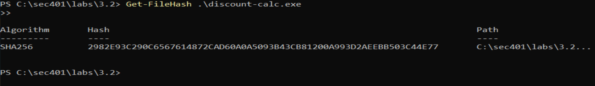
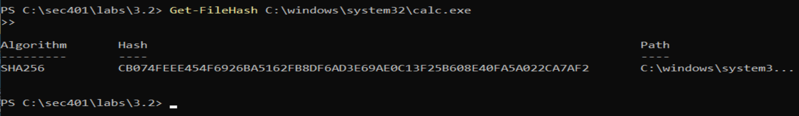
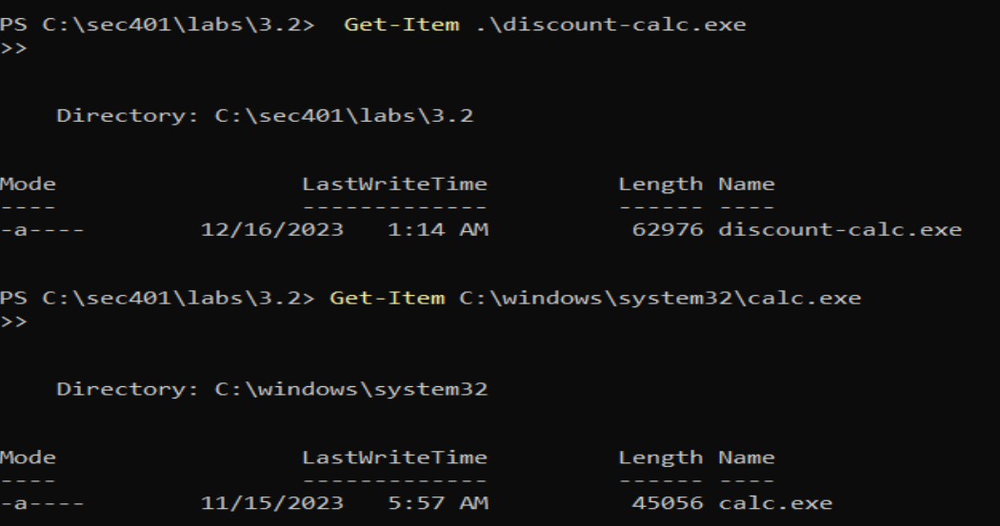
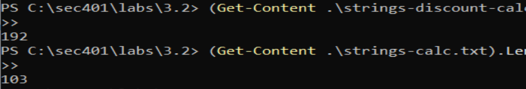
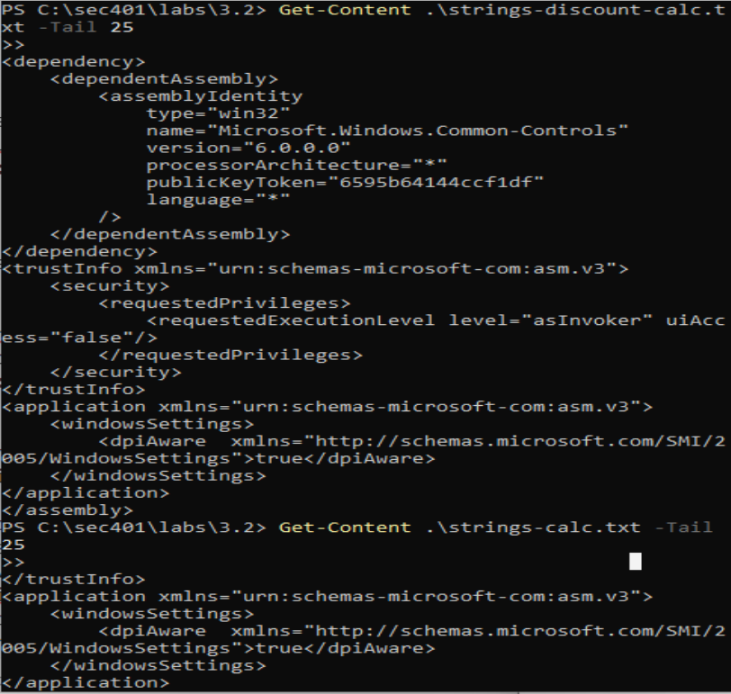
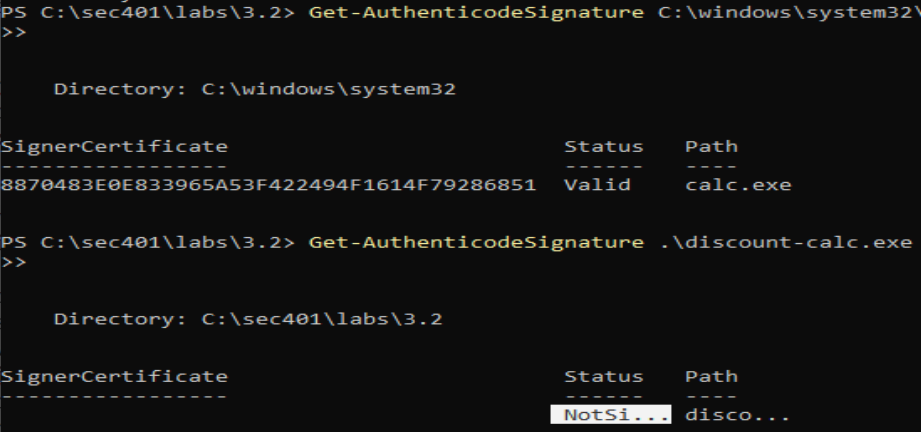

# Lab 36 - Binary File Analysis

## Lab Objective

The purpose of this lab was to analyze a potentially suspicious Windows executable without running it.

The lab focused on using PowerShell and supporting command-line tools to compare a suspicious file against a known legitimate executable. 
The analysis included reviewing file hashes, file sizes, strings, and digital signatures.

A key part of this lab was safe handling. The suspicious executable was modified so it was no longer executable, but it still should not be run. 
Security analysis should avoid causing additional harm to the environment, especially when reviewing potentially malicious files.

## Professional Relevance

### GRC Relevance

From a GRC perspective, this lab connects to file integrity, software trust, control validation, and malware handling procedures.

This lab reinforces several governance and risk concepts:
- Suspicious files should be handled using documented procedures.
- Hashes can support file integrity validation and evidence tracking.
- Digital signatures help verify software authenticity and publisher identity.
- Unsigned files are not automatically malicious, but they may require additional review.
- Control validation should confirm whether software matches expected baselines.
- Analysts should avoid executing suspicious files during review.

This type of analysis supports malware response, endpoint security review, software inventory validation, and incident documentation.

### IT Support / SOC Analyst Relevance

From an IT support perspective, this lab shows how to safely investigate a suspicious file reported by a user or found on a system.

From a SOC analyst perspective, this lab supports malware triage and indicator gathering.

The techniques in this lab can help answer questions such as:
- Is this file the same as a known legitimate file?
- Has the file been modified?
- Is the file signed by a trusted publisher?
- Does the file contain suspicious strings?
- Does the file size differ from the expected version?
- Is there enough evidence to escalate the file for deeper malware analysis?

This lab also reinforces a key analyst habit: do not execute suspicious files just to see what happens.

## Lab Environment

This lab was completed on a Windows 11 Enterprise VM.

Suspicious file location:
```powershell
C:\sec401\labs\3.2
```

Suspicious file analyzed:
```powershell
discount-calc.exe
```

Known legitimate comparison file:
```powershell
C:\windows\system32\calc.exe
```

## Safety Note

The suspicious file should not be executed. Even though discount-calc.exe was modified so it could no longer run, malware analysis should be performed carefully. 
Running suspicious files can cause additional harm, trigger payloads, alter evidence, or affect the analysis environment.

This lab used static analysis techniques instead. Static analysis means reviewing file characteristics without executing the file.

## Walkthrough

### Task 1 - Change to the Lab Directory

I started by changing into the directory containing the suspicious executable.
```powershell
cd C:\sec401\labs\3.2
```

### Task 2 - Hash the Suspicious Executable

Next, I generated a hash of the suspicious executable.
```powershell
Get-FileHash .\discount-calc.exe
```

A file hash provides a unique identifier based on the contents of the file. If the file changes, the hash should also change.

#### Analysis

Hashing is useful because it allows analysts to identify and compare files without relying only on filenames or appearance.

From a GRC perspective, hashing supports integrity validation and evidence documentation.

From an IT support or SOC perspective, hashing can help compare a suspicious file against a known-good file, threat intelligence source, or malware database.

### Task 3 - Hash the Legitimate Calculator Executable

The suspicious executable was designed to look like a calculator. To compare it against the legitimate Microsoft calculator executable, I generated a hash of calc.exe.
```powershell
Get-FileHash C:\windows\system32\calc.exe
```





#### Analysis

The hashes for discount-calc.exe and calc.exe did not match. This confirms that the files are different, even if they may appear similar to the user.

A mismatch does not automatically explain what changed, but it does show that the suspicious file is not identical to the legitimate Microsoft calculator executable.

### Task 4 - Compare File Characteristics

Next, I reviewed the file characteristics of the suspicious executable.
```powershell
Get-Item .\discount-calc.exe
```

I also compared the suspicious file against the legitimate calculator executable.


#### Analysis

The file sizes were different. The suspicious discount-calc.exe file contained more data than the legitimate Microsoft calc.exe file. This may indicate that additional code or content was added to the executable.

From a SOC analyst perspective, file size differences are not proof of malware on their own, but they are useful clues when combined with hash mismatches, string differences, and signature issues.

In this scenario, the added content was consistent with malicious modification.

### Task 5 - Extract Strings from the Suspicious Executable

Next, I used strings to extract human-readable text from the suspicious executable.
```powershell
strings -n 10 /accepteula .\discount-calc.exe > strings-discount-calc.txt
```

Command breakdown:
- ```strings``` extracts readable text from a binary file.
- ```-n 10``` limits output to strings that are at least 10 characters long.
- ```/accepteula``` accepts the Sysinternals tool license agreement.
- ```>``` redirects the output into a text file.

#### Analysis

Extracting strings can reveal artifacts left inside a compiled binary. These may include file paths, URLs, commands, registry keys, error messages, imported functions, or other readable indicators.

Strings do not prove malicious behavior by themselves, but they can provide leads for deeper analysis.

### Task 6 - Open Strings Output in Notepad

I opened the strings output files in Notepad for review.
```powershell
notepad .\strings-discount-calc.txt
notepad .\strings-calc.txt
```

#### Analysis

Reviewing the strings manually can help identify visible differences between the suspicious executable and the legitimate executable. However, manual review can be difficult when the files contain many lines. PowerShell can help compare the amount and location of the string output.

### Task 7 - Count the Number of Extracted Strings

To compare the amount of strings found in each file, I counted the number of lines in each strings output file.
```powershell
(Get-Content .\strings-discount-calc.txt).Length
(Get-Content .\strings-calc.txt).Length
```



Result

The suspicious file contained more extracted strings than the legitimate calculator file.

The output showed:

strings-discount-calc.txt: 192 lines
strings-calc.txt: 103 lines

This means the suspicious file contained 89 additional lines of strings.

#### Analysis

The higher number of strings suggested that discount-calc.exe contained additional content compared to calc.exe.

This supported the earlier findings:
- The hashes did not match.
- The file sizes were different.
- The suspicious file contained more readable strings.

Each individual clue may not be enough alone, but together they build a stronger case that the file has been modified.

### Task 8 - Review the End of Each Strings File

Since extra strings are often found toward the bottom of a file, I reviewed the last 25 lines of each strings output file.
```powershell
Get-Content .\strings-discount-calc.txt -Tail 25
Get-Content .\strings-calc.txt -Tail 25
```



#### Analysis

The ```-Tail``` option allowed me to quickly review the end of each file without opening the entire text file. This is useful during triage because it helps analysts quickly compare sections of output and identify where differences may appear.

### Task 9 - Review the Additional Strings

Since the suspicious file had 89 more lines than the legitimate calculator file, I reviewed the last 89 lines of the suspicious strings output.
```powershell
Get-Content .\strings-discount-calc.txt -Tail 89
```

#### Analysis

The strings found in this section were not suspicious by themselves. Some of the same strings may also appear in the legitimate calculator executable. The issue was duplication.

The duplicated strings appeared to relate to an application manifest. A manifest tells Windows how to handle an executable, including settings related to UAC prompts and visual style.

Duplicated manifest strings can indicate tampering, especially when combined with other red flags such as:
- A cloned application
- Hash mismatch
- File size difference
- Extra string content
- Missing digital signature

In this lab, the duplicated content appeared to be a byproduct of adding a malicious payload to a legitimate-looking calculator executable. The payload was used for command-line based command and control of the victim system.

### Task 10 - Check Digital Signatures

The final check was to review the digital signatures of both executables. Many, but not all, software vendors, including Microsoft, digitally sign their executables.

A digital signature helps attach publisher identity to file integrity. If a file is signed properly, analysts can verify who signed it and whether the file has been altered since signing.
```powershell
Get-AuthenticodeSignature C:\windows\system32\calc.exe
Get-AuthenticodeSignature .\discount-calc.exe
```



Result

The legitimate Microsoft calc.exe file was verified as a properly signed executable.

The suspicious discount-calc.exe file was not signed.

#### Analysis

An unsigned executable is not automatically malicious. Many legitimate tools and applications may be unsigned.

In this scenario, the unsigned status added to the concern because the file was already suspicious for several reasons:
- It was made to look like a legitimate calculator.
- Its hash did not match the legitimate Microsoft calculator.
- Its file size was different.
- It contained additional strings.
- It appeared to contain duplicated manifest content.
- It was not digitally signed by Microsoft.

Together, these findings supported the conclusion that discount-calc.exe was not the legitimate Microsoft calculator and had been maliciously modified.

## Key Takeaways

This lab reinforced several important analysis concepts:
- Suspicious executables should not be run during initial review.
- File hashes help identify and compare files.
- Hash mismatches confirm that two files are not identical.
- File size differences can indicate added or removed content.
- Strings can reveal readable artifacts inside a binary.
- Additional strings may provide clues during malware triage.
- Duplicated manifest strings can indicate tampering when combined with other evidence.
- Digital signatures help validate publisher identity and file integrity.
- Unsigned files are not automatically malicious, but they may require additional review.
- Strong analysis comes from combining multiple indicators.
